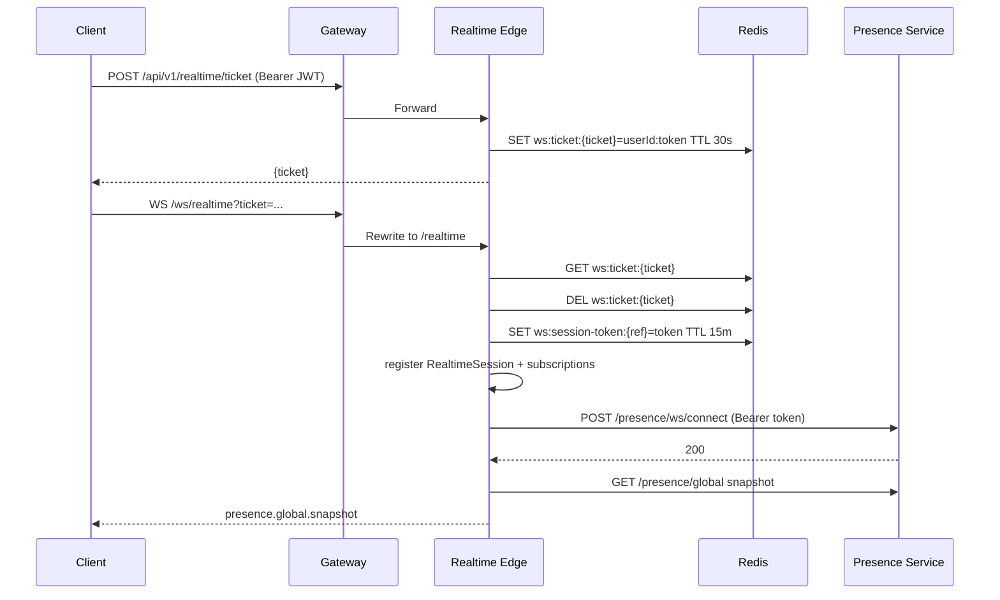
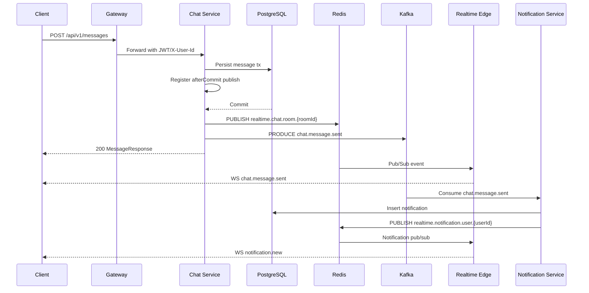
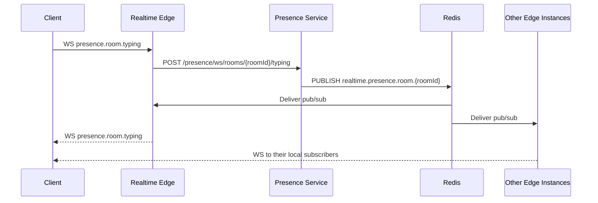
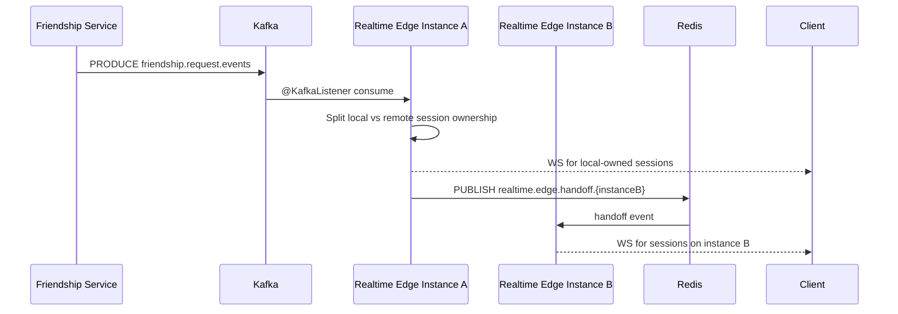
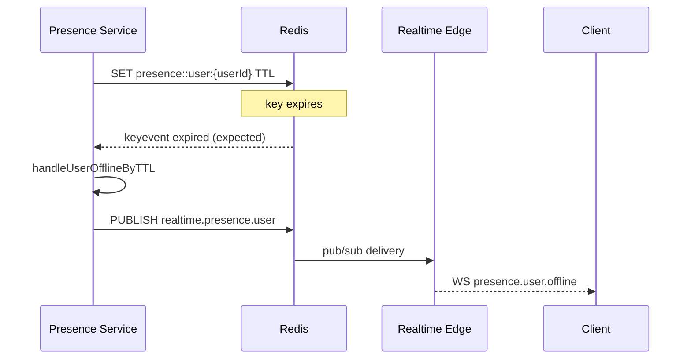
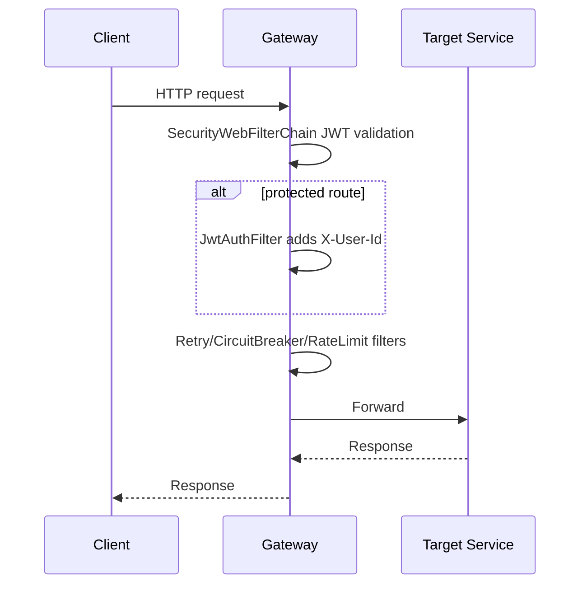

# 11. Runtime Sequence Diagrams

## 1) WebSocket Connect With Ticket

## 2) Send Message Full Path

## 3) Typing Event Path

## 4) Friendship Kafka To Cross-Instance Delivery

## 5) Presence Offline By TTL

## 6) Gateway Security + Route Pipeline

