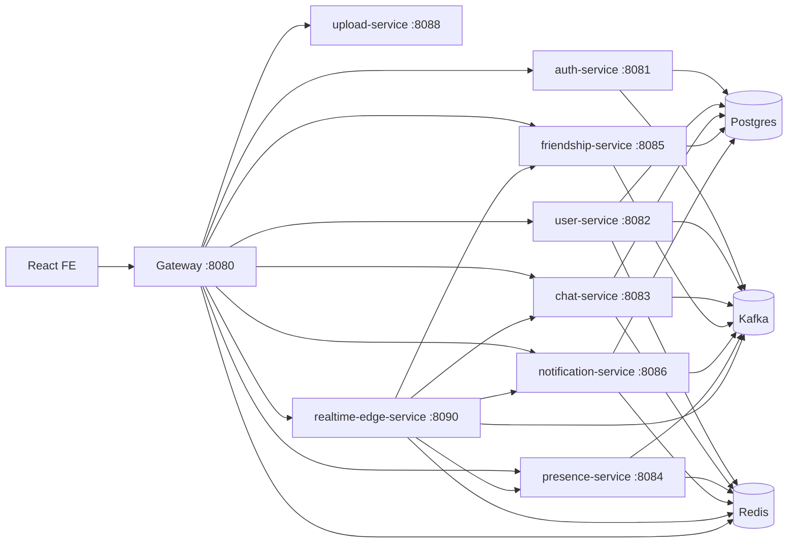

# 00. System Overview

## Purpose
This repository implements a production-oriented chat platform with:
- account and identity management
- user profiles
- rooms, messages, reactions, pinning, moderation
- friendship and block graph
- notifications
- presence and typing
- media upload
- gateway ingress and realtime websocket fanout

Primary backend root: `chatappBE`.
Primary frontend root: `chatappFE`.

## Architecture Style
The backend is a microservice system with shared internal libraries.
- Synchronous communication: HTTP/REST through gateway and service-to-service calls (Feign/HTTP client).
- Asynchronous communication: Kafka for durable cross-service events.
- Low-latency fanout and ephemeral state: Redis pub/sub + Redis sets/keys.
- Realtime ingress: websocket through gateway to `realtime-edge-service` (`/ws/**` -> `/realtime`).

This is not a monolith. It is a domain-partitioned distributed system with a shared common layer.

## Bounded Contexts
- Identity context: `auth-service`
- Profile context: `user-service`
- Messaging context: `chat-service`
- Social graph context: `friendship-service`
- Notification context: `notification-service`
- Presence context: `presence-service`
- Media context: `upload-service`
- Ingress/routing context: `gateway-service`
- Realtime orchestration context: `realtime-edge-service`

## Runtime Topology (Local Docker)
Validated from `chatappBE/docker-compose.local.yml` and `gateway-service/src/main/resources/application.yaml`.

## High-Level Communication Model
- Client REST -> Gateway -> target service routes (`/api/v1/**`).
- Client websocket -> Gateway `/ws/**` -> `realtime-edge-service` `/realtime`.
- Domain services emit events to Kafka and Redis using `common-kafka` and `common-redis` abstractions.
- `realtime-edge-service` consumes events and fans out to connected websocket sessions.

## Why This Design Exists
- Service separation reduces single-service blast radius and allows independent scaling.
- Kafka supports replay-sensitive/eventual-consistency workflows.
- Redis is used for low-latency ephemeral operations (presence, subscriptions, pub/sub fanout).
- Gateway centralizes ingress concerns: CORS, JWT guard, rate limiting, circuit breaker, retries.

## Operational Assumptions
- Internal network trust exists between services (plus optional internal token filters in some services).
- Clocks are close enough for JWT skew tolerance (~60s default in gateway).
- Redis and Kafka are critical infrastructure dependencies; degraded behavior is expected if either is unavailable.

## Key Architectural Strengths
- Clear domain boundaries by service.
- Shared event envelope contract in `common-events`.
- Realtime edge consolidation pattern exists (phase migration away from per-service websocket logic).
- Gateway-level resilience controls (retry, circuit breaker, readiness checks).

## Key Architectural Liabilities
- Runtime consistency depends on mixed durability layers (Kafka + Redis pub/sub).
- Some authorization and cache coherence checks depend on short-lived Redis-cached membership.
- Entity schema is mostly JPA `ddl-auto: update` driven; migration governance is weak.
